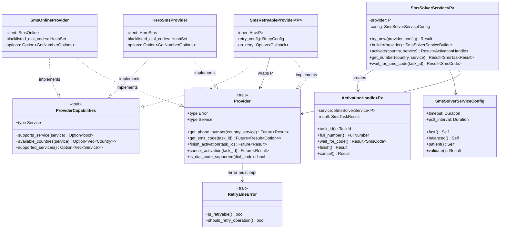
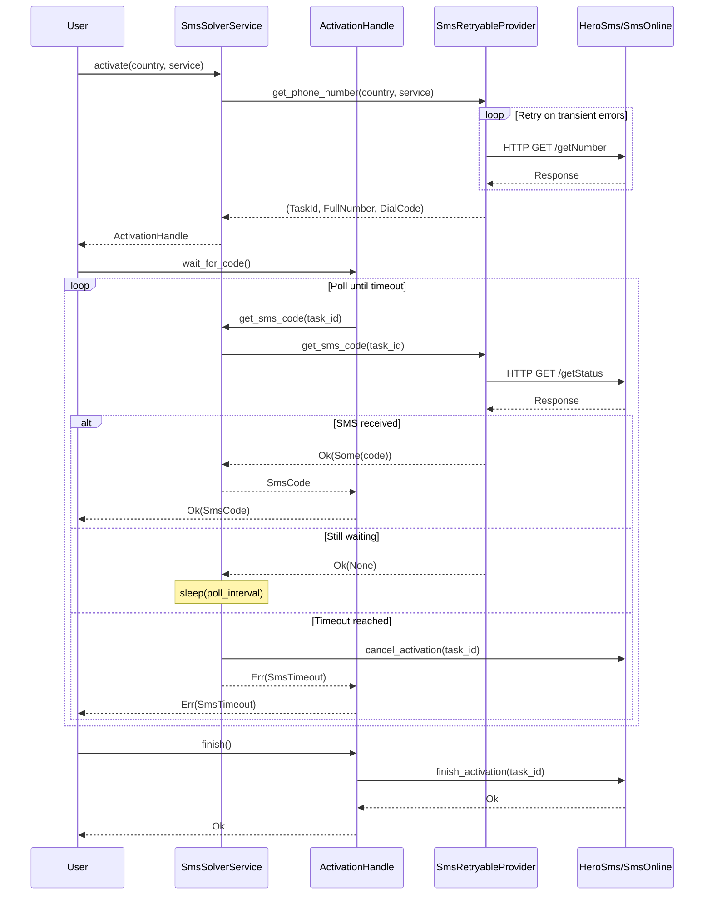
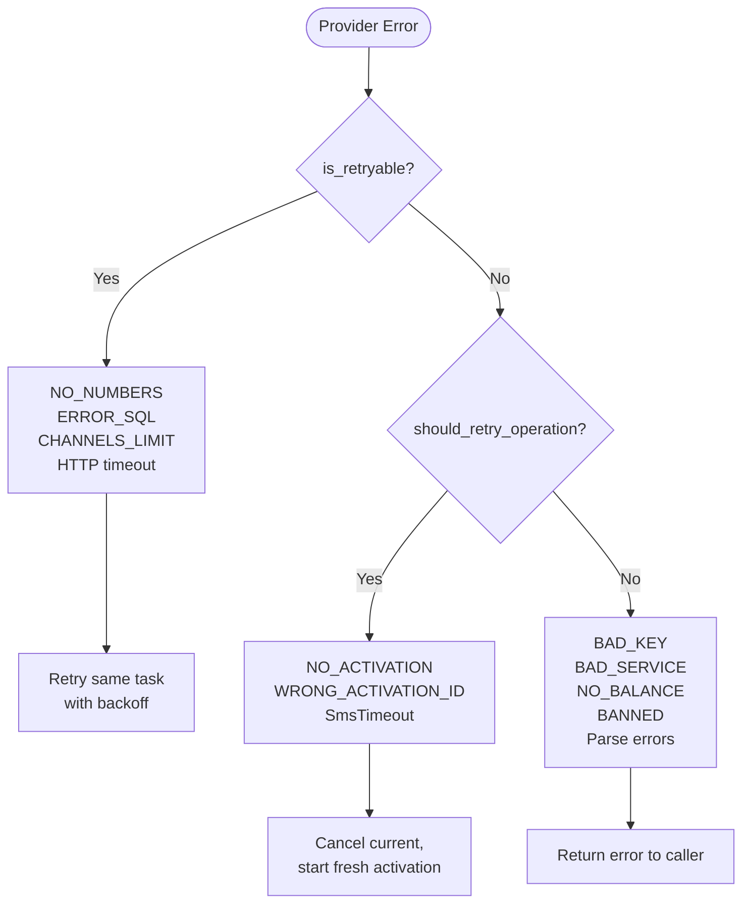

# Architecture

## Layering



## Activation Lifecycle



## Error Classification



## Error Ownership

| Layer | Error Type | Responsibility |
|-------|-----------|----------------|
| HTTP client | `HeroSmsError` / `SmsOnlineError` | Transport, parsing, service-level errors |
| Provider trait | `Provider::Error` | Classified via `RetryableError` (retryable vs permanent) |
| Retry wrapper | `P::Error` | Passes through; retries based on `is_retryable()` |
| Service | `SmsSolverServiceError` | Wraps provider errors, adds timeout/cancel/blacklist errors |

### RetryableError Two-Level Classification

```rust
pub trait RetryableError {
    fn is_retryable(&self) -> bool;           // Retry the SAME task
    fn should_retry_operation(&self) -> bool;  // Retry with a FRESH task
}
```

- `is_retryable()` = true: transient error, same activation can be retried (e.g., `NO_NUMBERS`, HTTP timeout)
- `should_retry_operation()` = true: permanent for this activation, but a new attempt might succeed (e.g., `NO_ACTIVATION`, `WRONG_ACTIVATION_ID`)

## Retry Policy

`SmsRetryableProvider<P>` uses the `backon` crate for exponential backoff. Retry decisions are driven by `is_retryable()` on the provider's error type. The retry wrapper:

1. Only retries `get_phone_number` and `get_sms_code` (not finish/cancel)
2. Calls `is_retryable()` on each error to decide whether to retry
3. Supports an optional `on_retry` callback for observability

## Lifecycle Model

1. **Acquire**: `service.activate(country, service)` → `ActivationHandle`
2. **Poll**: `handle.wait_for_code()` — polls with configured interval until timeout
3. **Complete**: `handle.finish()` — marks activation as used
4. **Cancel**: `handle.cancel()` — releases the number (also called automatically on timeout/error)

The `ActivationHandle` consumes itself on `finish()` and `cancel()` to prevent use-after-complete.

Legacy flow (`get_number` + `wait_for_sms_code`) remains available for backward compatibility.

## Capability Discovery

Discovery methods (`supports_service`, `available_countries`, `supported_services`) are separated from the core `Provider` trait into `ProviderCapabilities`:

```rust
pub trait ProviderCapabilities: Send + Sync {
    type Service: Clone + Send + Sync;
    fn supports_service(&self, service: &Self::Service) -> Option<bool>;
    fn available_countries(&self, service: &Self::Service) -> Option<Vec<Country>>;
    fn supported_services(&self) -> Option<Vec<Self::Service>>;
}
```

Returns `Option<T>` instead of definitive answers. `None` means the provider cannot determine the answer reliably (honest unknown).

## Extension Points

### Adding a new provider

See [`docs/adding-provider.md`](adding-provider.md).

### Configuration

`SmsSolverServiceConfig` supports presets (`fast()`, `balanced()`, `patient()`) and custom values via builder. All configs are validated on construction via `try_new` / `try_build`.

### Feature flags

| Flag | Default | Description |
|------|---------|-------------|
| `hero-sms` | yes | Hero SMS provider |
| `sms-online` | yes | SMS.online provider |
| `tracing` | yes | OpenTelemetry tracing spans |
| `metrics` | no | OpenTelemetry counters/histograms |
| `random` | yes | Random dial code selection |
